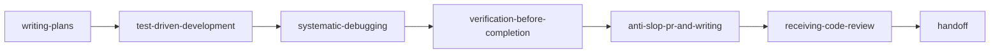

<!-- SPDX-FileCopyrightText: 2026 Sebastien Rousseau -->
<!-- SPDX-License-Identifier: Apache-2.0 OR MIT -->

<p align="center">
  
</p>

<h1 align="center">agtmls</h1>

<p align="center">
  The universal agent skills registry — polyglot engineering skills, system prompts, commands, and subagents for Claude Code, OpenAI Codex, Aider, Google Antigravity, and compatible runtimes.
</p>

<p align="center">
  <a href="https://github.com/sebastienrousseau/agtmls/actions/workflows/validate.yml"></a>
  <a href="https://pypi.org/project/agtmls/"></a>
  <a href="https://github.com/sebastienrousseau/agtmls/releases"></a>
  <a href="https://scorecard.dev/viewer/?uri=github.com/sebastienrousseau/agtmls"></a>
  <a href="LICENSE-APACHE"></a>
  <a href="https://github.com/sebastienrousseau/agtmls/blob/main/pyproject.toml">= 3.10" /></a>
</p>

---

## Contents

**Getting started**

- [Install](#install) — CLI tool (uvx / pipx), Python library, agent plugins, source
- [Requirements](#requirements) — Python toolchain floor, platform support, zero dependencies
- [Quick Start](#quick-start) — inspect, install, and audit in seconds

**Registry & Capabilities**

- [Capabilities at a glance](#capabilities-at-a-glance) — 31 skills, 4 commands, 4 subagents, 13 provider targets
- [The Discipline Skills Pipeline](#the-discipline-skills-pipeline) — ordered engineering lifecycle from plan to handoff
- [Anti-Slop & Editorial Doctrine](#anti-slop--editorial-doctrine) — human-voice preservation and AI filler removal
- [ToxicSkills & Supply Chain Security](#toxicskills--supply-chain-security) — static security analyzer, steganography defense, SBOM
- [Skill Anatomy & Router Contract](#skill-anatomy--router-contract) — frontmatter specification, trigger cues, progressive disclosure
- [General Skills vs Project Bundles](#general-skills-vs-project-bundles) — flat directory structure and scoped metadata
- [Providers & Profiles](#providers--profiles) — native symlinks, runtime plugins, and adapted exports

**CLI & Tooling Reference**

- [CLI Reference](#cli-reference) — dispatcher usage, registry discovery, and diagnostic commands
- [Shell Completions & Manpages](#shell-completions--manpages) — native completions for Bash, Zsh, Fish, and man1 manual
- [Directory Structure](#directory-structure) — full repository layout

**Operational**

- [When not to use AgtMLS](#when-not-to-use-agtmls) — design scope and intentional boundaries
- [Development](#development) — make targets, 65-gate validation suite, benchmarks
- [Security & Hardening](#security--hardening) — zero-dependency architecture, signing keys, private disclosure
- [Documentation](#documentation) — canonical specifications, ADRs, and developer guides
- [Stability guarantees](#stability-guarantees) — strict pre-1.0 SemVer (`v0.0.1` → `v0.0.999`), output determinism
- [License](#license) — Apache-2.0 OR MIT dual licensing

---

## Why this exists

Agent skills are instructions a model will follow. Copying them between
repositories by hand means no two checkouts agree, nobody can say whether an
installed skill is the one that was published, and a hidden instruction in one
of them is invisible until a model acts on it.

AgtMLS is the registry: skills are content-addressed, installs are verified
against a lockfile, and every file is analysed before it ships.

## Install

### As a CLI tool (zero clone required)

`agtmls` is distributed as a zero-dependency Python wheel. It can be run immediately without installation via `uvx` or installed persistently via `pipx`:

```bash
# One-shot execution (ephemeral cache)
uvx agtmls install rust claude --skills-only --bundle noyalib

# Persistent installation
pipx install agtmls
agtmls install rust claude
```

Because the package is **100% dependency-free** (standard library only), `uvx` resolves and launches instantaneously with no transitive package risks.

### As a Python package (PyPI)

```bash
pip install agtmls
```

### As an Agent Plugin

AgtMLS integrates directly with modern coding agent plugin managers without requiring a local git checkout:

| Runtime | Installation Command / Action | Manifest Location |
| :--- | :--- | :--- |
| **Claude Code** | `/plugin marketplace add sebastienrousseau/agtmls`<br/>`/plugin install agtmls@agtmls` | `.claude-plugin/plugin.json` |
| **Google Antigravity** | `agy plugin install https://github.com/sebastienrousseau/agtmls` | `plugin.json` |
| **OpenAI Codex** | `/plugins` → Search `agtmls` → **Install Plugin** | `.agents/plugins/marketplace.json`<br/>`.codex-plugin/plugin.json` |
| **Gemini CLI** | `gemini extensions install https://github.com/sebastienrousseau/agtmls` | `gemini-extension.json`<br/>`GEMINI.md` |
| **Cursor** | `/add-plugin agtmls` | `.cursor-plugin/plugin.json` |
| **Kimi Code** | `/plugins install https://github.com/sebastienrousseau/agtmls` | `.kimi-plugin/plugin.json` |
| **OpenCode** | Follow instructions in `.opencode/INSTALL.md` | `.opencode/INSTALL.md` |

All plugin manifests are derived automatically from `.claude-plugin/plugin.json` and the skill tree via `python3 scripts/generate-plugin-manifests.py`.

### As a native workspace symlink (hub-and-spoke)

For local development across your active repositories, use the hub-and-spoke setup. In this mode, skills and prompts are symlinked directly from your local clone so changes take effect immediately:

```bash
# 1. Clone AgtMLS locally
git clone https://github.com/sebastienrousseau/agtmls.git ~/dev/agtmls

# 2. Navigate to your target application repository
cd ~/dev/my-service

# 3. Link skills and conventions
~/dev/agtmls/scripts/setup-workspace.sh rust claude
```

`setup-workspace.sh` configures the native prompt conventions (`CLAUDE.md`, `AGENTS.md`, or `CONVENTIONS.md`) and symlinks active skills into `.claude/skills/`, `.codex/skills/`, `.aider/skills/`, or `.agents/skills/`. All links and generated files are automatically added to `.git/info/exclude` to ensure your repository working tree remains clean.

### Build and install from source (Unix Makefile)

AgtMLS implements the standard Unix packaging contract honoring `PREFIX` (default `/usr/local`) and `DESTDIR`:

```bash
git clone https://github.com/sebastienrousseau/agtmls.git
cd agtmls

# Run test suites and diagnostics
make test
make doctor

# Install CLI binary, manpage, and shell completions
sudo make install

# Or install to an isolated staging directory (FHS compliant)
make DESTDIR=/tmp/stage install
```

---

## Requirements

- **Python 3.10 or newer.** Tested and validated across Python 3.10, 3.11, 3.12, 3.13, and 3.14 on macOS and Ubuntu runners in GitHub Actions CI.
- **Zero runtime dependencies.** Every script, validator, generator, and CLI command in AgtMLS is written exclusively using Python's standard library. No `pip install` required.
- **Cross-platform.** Verified on Linux, macOS (Apple Silicon and Intel), and POSIX environments.
- **Standard Git.** Commits and tags require cryptographic signing (OpenSSH `ed25519` allowed signers in [`KEYS.asc`](KEYS.asc)).

---

## Quick Start

### 1. Explore available skills and commands

```bash
# List all 31 registered skills
agtmls list

# List all interactive slash commands
agtmls list commands

# Search for skills by topic or tag
agtmls search debugging

# Inspect metadata, risk level, and prompt instructions for a skill
agtmls show anti-slop-pr-and-writing
```

### 2. Audit skills for prompt injection and security risks

Statically scan any local skill, prompt file, or the entire registry for toxic patterns:

```bash
# Scan all skills with strict validation
agtmls audit --all --strict
```

### 3. Verify repository and agent health

```bash
# Run local diagnostic health checks
agtmls doctor

# Execute the full 65-gate validation suite
agtmls check
```

---

## Capabilities at a glance

| Component | Count | Description | Primary Location |
| :--- | :--- | :--- | :--- |
| **Engineering Skills** | 31 | Modular, trigger-based technical instructions conforming to the [Agent Skills specification](https://agentskills.io) | [`skills/`](skills/) |
| **System Prompts** | 10 | Universal engineering standards (`_base.md`) + 9 language profiles (Rust, Python, Go, C++, Swift, TS, JS, Ruby, Bash) | [`system-prompts/`](system-prompts/) |
| **Slash Commands** | 4 | Interactive agent actions (`agtmls`, `agtmls-audit`, `agtmls-new-skill`, `agtmls-release`) | [`commands/`](commands/) |
| **Subagents** | 4 | Context-isolated autonomous roles (`anti-slop-editor`, `security-sentinel`, `skill-author`, `registry-auditor`) | [`agents/`](agents/) |
| **Security Auditor** | 1 | Zero-dependency static scanner detecting prompt injection, unicode steganography, and unsafe commands | [`scripts/audit-skill.py`](scripts/audit-skill.py) |
| **Provider Targets** | 13 | Cross-runtime support via native symlinks, plugin manifests, and adapted markdown bundles | [`providers.json`](providers.json) |
| **Named Profiles** | 6 | Curated subsets for specific workflows (`minimal`, `polyglot`, `discipline`, `security`, `research`, `noyalib`) | [`profiles.json`](profiles.json) |

---

## The Discipline Skills Pipeline

Six general skills (`bundle: null`) govern day-to-day software engineering in any programming language. They compose sequentially across the software delivery lifecycle:



| Phase | Skill | Core Invariant Enforced |
| :--- | :--- | :--- |
| **Decompose** | [`writing-plans`](skills/writing-plans/) | A step is done only when something observable changes. Decompose multi-step tasks before modifying code. |
| **Build** | [`test-driven-development`](skills/test-driven-development/) | A test you have not seen fail proves nothing. Write minimal failing tests before implementation. |
| **Diagnose** | [`systematic-debugging`](skills/systematic-debugging/) | No edit before an explanation. Formulate hypotheses and identify root causes with minimal reproductions. |
| **Verify** | [`verification-before-completion`](skills/verification-before-completion/) | A claim you have not observed is a guess. Fresh test logs and commands are required before marking complete. |
| **Polish** | [`anti-slop-pr-and-writing`](skills/anti-slop-pr-and-writing/) | Engineers read diffs to understand intent and mechanics. Eliminate conversational filler and robotic clichés. |
| **Review** | [`receiving-code-review`](skills/receiving-code-review/) | Every review comment gets an explicit technical decision, code adjustment, or empirical reply. |
| **Handoff** | [`handoff`](skills/handoff/) | Document exact branch state, test commands, and open questions so readers act without asking questions. |

---

## Anti-Slop & Editorial Doctrine

The [`anti-slop-pr-and-writing`](skills/anti-slop-pr-and-writing/) skill and [`anti-slop-editor`](agents/anti-slop-editor.md) subagent enforce clean, dense, human-sounding technical communication across Pull Request summaries, git commits, code comments, and documentation.

### The Five Patterns Stripped on Sight

1. **Conversational Sycophancy & Robotic Apologies**:
   - *Strip*: `"Certainly!"`, `"I'd be happy to help!"`, `"As an AI language model..."`, `"Sorry for the oversight."`
   - *Enforce*: Direct technical statements of action, findings, or code changes.
2. **Throat-Clearing Openers**:
   - *Strip*: Temporal clichés about fast-paced eras, `"Here's the thing..."`, `"Let's dive in..."`
   - *Enforce*: The problem, failure mode, or architectural decision stated in sentence one.
3. **Binary Contrasts & Fake Profundity**:
   - *Strip*: `"It's not X. It's Y."`, `"The future isn't coming; it's already here."`
   - *Enforce*: Concrete engineering trade-offs, benchmarks, and empirical measurements.
4. **Fluffy PR Summaries & Emoji Theater**:
   - *Strip*: Rocket emojis (`🚀`), party poppers (`🎉`), and bullet points that merely re-state git diff filenames.
   - *Enforce*: The underlying *Why* (the root cause) and the architectural *What*, followed by benchmark or test proof.
5. **Defensive Syntax Paraphrasing in Code**:
   - *Strip*: Comments that state the obvious syntax (`// increment counter`, `// return result`).
   - *Enforce*: Comments explaining non-obvious *invariants*, race condition prevention, or hardware constraints.

For the full catalog of before-and-after transformations, see [`skills/anti-slop-pr-and-writing/reference.md`](skills/anti-slop-pr-and-writing/reference.md).

---

## ToxicSkills & Supply Chain Security

AgtMLS includes proactive defense against malicious third-party prompt injection, unauthorized outbound network access, and capability escalation.

### Static Security Auditor (`agtmls audit`)

The built-in static analyzer ([`scripts/audit-skill.py`](scripts/audit-skill.py)) inspects every file in a skill — markdown, shell, Python, JSON and anything carrying the executable bit — without executing untrusted code. Every finding carries a stable rule identifier (`AGT-STEG-001`, `AGT-EXEC-003`, …) so it can be suppressed, exported or tracked individually:

```bash
# Scan a single skill directory or markdown file
agtmls audit skills/my-skill

# Scan the entire registry and fail on any warning
agtmls audit --all --strict --json
```

### Attack Vectors Defended

- **Invisible Unicode Steganography** (`AGT-STEG-*`): Zero-width spaces (`\u200B`–`\u200D`, `\uFEFF`), bidirectional override markers (`\u202A`–`\u202E`, `\u2066`–`\u2069`), variation selectors (`\uFE00`–`\uFE0F`), soft hyphens, invisible mathematical operators (`\u2061`–`\u2064`), Hangul fillers, and Unicode tag characters (`\U000E0000`–`\U000E007F`) used to conceal prompt injection from human reviewers.
- **Prompt Injection & Persona Jailbreaks** (`AGT-INJ-*`): Detection of instruction overrides (`"ignore previous instructions"`), developer-mode exploits, and security guardrail bypasses.
- **Dangerous Shell Invocations** (`AGT-EXEC-*`): Unauthorized pipe-to-shell commands (`curl | bash`), root wipes (`rm -rf /`), credential access (`~/.ssh`, `~/.aws`), and reverse shells.
- **Data Exfiltration Pingbacks** (`AGT-EXFIL-*`): Detection of covert markdown image pingbacks intended to leak session context or environment variables.
- **Capability Escalation** (`AGT-CAP-*`): Frontmatter that grants `Bash`, `Write` or `WebFetch` while `metadata.json` declares those capabilities denied. The runtime honours the frontmatter, so the two disagreeing is the escalation.
- **Policy Honesty Checks** (`AGT-POLICY-*`): Skills declaring `executes_commands: false` or `network_access: none` that instruct models to run commands or fetch URLs. A missing or unparseable `metadata.json` is itself a finding — an unattested skill is not a safe skill.

### Content-addressed skills and install verification

Every skill in [`index.json`](index.json) carries an `integrity` digest — a
SHA-256 over a manifest of its files, defined normatively in
[`agtmls-spec`](https://github.com/sebastienrousseau/agtmls-spec) and stable
across a git clone, a `--copy` install, an extracted wheel and a release
tarball.

```bash
agtmls install rust claude          # verifies the registry, then records a lockfile
agtmls verify claude                # re-checks the installed tree
```

`install` verifies the **source** registry against `index.json` before copying
anything and refuses with exit `3` if they disagree — checking after a
tampered skill has been copied into your repository would not be a control. It
then writes `.agtmls/manifest.json` recording what was installed and what each
skill hashed to.

`verify` recomputes those digests:

| Status | Meaning | Exit |
| :--- | :--- | ---: |
| *(clean)* | Every recorded skill is byte-identical to what was installed | `0` |
| `MODIFIED` | Content changed since install — a local edit, or tampering | `3` |
| `MISSING` | Recorded in the lockfile but no longer present | `3` |
| `UNMANAGED` | Present but not installed by AgtMLS. Reported, never deleted | `0` |

Verification **reports rather than repairs**: silently rewriting a skill whose
digest moved would destroy a local edit and would hide tampering behind the
same behaviour.

### Evasion resistance

Detectors are only meaningful if they survive a determined author, so the
analyzer is gated against an adversarial corpus
([`evals/security/corpus.json`](evals/security/corpus.json), run by
[`scripts/run-security-evals.py`](scripts/run-security-evals.py)) rather than
against one canonical string per rule. It covers payloads split across
newlines, alternate invisible-character channels, malicious code in
non-markdown files, and skills that simply omit the metadata declaring their
policy. Benign fixtures in the same corpus gate false positives.

### Untrusted import

`agtmls import-skill` audits before it copies and refuses on any CRITICAL or
HIGH finding. Imported skills are recorded as unattested — `maturity: draft`,
`risk_level: high`, `requires_human_review: true` — with the source's own
`metadata.json` preserved as `metadata.source.json` and the audit findings
retained under `provenance.audit_findings`.

### Cryptographic Artifacts

Every release ships with cryptographic evidence:
- **SPDX 2.3 SBOM**: [`SBOM.spdx.json`](SBOM.spdx.json) tracks SHA-256 digests of all distributed skills, scripts, and commands.
- **SLSA Provenance Subject**: [`provenance.json`](provenance.json) binds release assets to git commit hashes.
- **Signed Commits & Tags**: Maintainer keys are published in [`KEYS.asc`](KEYS.asc).

---

## Skill Anatomy & Router Contract

Every skill in AgtMLS strictly adheres to the [Agent Skills Specification](https://agentskills.io/specification.md) and passes CI validation via [`scripts/validate-skills.py`](scripts/validate-skills.py).

### Frontmatter Contract

```yaml
---
name: anti-slop-pr-and-writing
description: "Eliminate AI slop, clichés, sycophancy, and robotic filler from PR descriptions, commit messages, code comments, and technical documentation. Load when reviewing or authoring PRs, drafting release notes, or stripping conversational apologies and binary contrasts while preserving human voice and technical facts."
license: Apache-2.0 OR MIT
compatibility: "Tested with Claude Code, Codex, Antigravity, and Aider skill layouts"
allowed-tools: "Read Glob Grep Write Edit"
metadata:
  agtmls-owner: "Sebastien Rousseau"
  agtmls-maturity: "hardened"
  agtmls-risk-level: "low"
  agtmls-network-access: "none"
  agtmls-writes-files: "true"
  agtmls-executes-commands: "false"
  agtmls-handles-secrets: "false"
  agtmls-requires-human-review: "true"
---
```

1. **Closed Key Set**: Only `name`, `description`, `license`, `compatibility`, `allowed-tools`, and `metadata` are permitted.
2. **Name Constraint**: Kebab-case, $\le 64$ characters, matching the directory name exactly.
3. **Trigger Cue**: Descriptions must be $\le 1024$ characters and contain explicit trigger cues (`"load when"`, `"use for"`, `"trigger"`) so routers activate them accurately.
4. **Progressive Disclosure Budget**: The main `SKILL.md` body is capped at **500 lines**. Extended catalogs, before/after tables, and API references must live in `reference.md` and be loaded on demand.
5. **Evaluations**: Every skill requires positive and negative trigger cases in [`evals/cases/`](evals/cases/) and behavioral assertions in [`evals/behavioral/cases/`](evals/behavioral/cases/).

---

## General Skills vs Project Bundles

The skill tree is deliberately **flat**: every skill resides at `skills/<name>/SKILL.md`.

Because agent runtimes scan their skills directories non-recursively, nesting skills inside subdirectories causes them to be silently ignored by Codex, Antigravity, Cursor, and Gemini CLI.

AgtMLS resolves this using metadata bundling in `metadata.json`:
- **General Skills** (`"bundle": null`): Universal engineering practices (e.g. `writing-plans`, `anti-slop-pr-and-writing`, `systematic-debugging`). Linked into all consumer repositories.
- **Project Bundles** (`"bundle": "noyalib"`): Specialized domain knowledge (e.g. `noyalib-validation-and-qa`). Linked **only** when explicitly requested via `--bundle <name>`.

```bash
# Standard repository: general discipline skills only
agtmls install python claude --skills-only

# Domain repository: general skills + noyalib project bundle
agtmls install rust claude --skills-only --bundle noyalib
```

---

## Providers & Profiles

AgtMLS reaches 13 agent runtimes and environments defined in [`providers.json`](providers.json):

| Mode | Target Runtimes | Mechanism |
| :--- | :--- | :--- |
| **Native Agents** | Claude Code, OpenAI Codex, Aider | Direct symlink installation via `setup-workspace.sh` |
| **Plugin Targets** | Google Antigravity, Cursor, Gemini CLI, Kimi Code, OpenCode | Native runtime plugin manifests (`plugin.json`, `.cursor-plugin/`, etc.) |
| **Export Targets** | GitHub Copilot, Continue, DeepSeek, Mistral, Ollama, Qwen, Windsurf, Zed | Provider-adapted Markdown bundles (`ADAPTERS.md`, rules, instructions) |

Generate standalone bundles using named profiles from [`profiles.json`](profiles.json):

```bash
# Export polyglot bundle for OpenAI-compatible agents
agtmls export --provider openai --profile polyglot --out-dir dist

# Export Claude-adapted bundle with noyalib domain rules
agtmls export --provider anthropic --profile noyalib --out-dir dist
```

---

## CLI Reference

`scripts/agtmls.py` is the dispatcher for all registry operations. When installed via `pip` or `pipx`, the command is available directly as `agtmls`.

```bash
# Local health and status
python3 scripts/agtmls.py doctor
python3 scripts/agtmls.py status

# Full gate validation (65 checks)
python3 scripts/agtmls.py check

# Static security audit
python3 scripts/agtmls.py audit --all --strict

# Registry discovery
python3 scripts/agtmls.py list
python3 scripts/agtmls.py list commands
python3 scripts/agtmls.py search yaml
python3 scripts/agtmls.py show anti-slop-pr-and-writing
python3 scripts/agtmls.py stats

# Evaluations and benchmarks
python3 scripts/agtmls.py bench

# Skill authoring and imports
python3 scripts/agtmls.py scaffold-skill candidate-skill
python3 scripts/agtmls.py import-skill /path/to/external/skill --name candidate-skill

# Manifest and artifact generation
python3 scripts/agtmls.py index --write
python3 scripts/agtmls.py plugin-manifests --write
python3 scripts/agtmls.py mcp-resources --write
python3 scripts/agtmls.py sbom --write
python3 scripts/agtmls.py provenance --write
python3 scripts/agtmls.py docs-site --write
```

For the complete command-line interface documentation, see [`docs/cli.md`](docs/cli.md).

---

## Shell Completions & Manpages

AgtMLS ships with native shell completions and Unix manuals generated directly from the CLI specification:

```bash
# Generate shell completions for Bash, Zsh, and Fish
make completions

# Generate Unix manual page (share/man/man1/agtmls.1)
make man

# Inspect manual page
man share/man/man1/agtmls.1
```

Shell completion files are installed to standard system locations (`/usr/local/share/bash-completion/completions/agtmls`, `/usr/local/share/zsh/site-functions/_agtmls`, and `/usr/local/share/fish/vendor_completions.d/agtmls.fish`) during `make install`.

---

## Directory Structure

```
agtmls/
├── .claude-plugin/              # Claude Code plugin and marketplace manifests
├── .github/                     # GitHub workflows, dependabot, issue/PR templates
│   ├── ISSUE_TEMPLATE/          # Structured YAML issue templates
│   ├── PULL_REQUEST_TEMPLATE.md # PR quality checklist and signing requirements
│   ├── dependabot.yml           # Automated dependency updates
│   └── workflows/               # CI validation and release automation
├── agents/                      # Context-isolated subagents (anti-slop, sentinel, auditor)
├── commands/                    # Interactive slash commands (agtmls, audit, release)
├── completions/                 # Generated shell completions (Bash, Zsh, Fish)
├── docs/                        # Architecture, CLI, checks, and reference documentation
├── evals/                       # Trigger routing and behavioral test suites
├── references/                  # Registry schema and bundle specifications
├── scripts/                     # Zero-dependency CLI, generators, and validators
├── share/man/man1/              # Generated Unix manpages (agtmls.1)
├── skills/                      # 31 flat skill directories (SKILL.md, metadata.json)
├── system-prompts/              # Base rules (_base.md) and 9 language profiles
├── CATALOG.md                   # Human-readable registry catalog
├── checks.json                  # Canonical 65-check validation registry
├── index.json                   # Machine-readable skill registry index
├── KEYS.asc                     # OpenSSH allowed signers for commit/tag verification
├── Makefile                     # Unix build and installation task runner
├── mcp-resources.json           # Model Context Protocol resource catalog
├── profiles.json                # Named installation and export profiles
├── provenance.json              # SLSA-aligned cryptographic release provenance
├── providers.json               # Native agents and 13 provider adapter targets
├── pyproject.toml               # Zero-dependency Python packaging specification
├── SBOM.spdx.json               # SPDX 2.3 software bill of materials
└── site/index.html              # Static documentation catalog
```

---

## When not to use AgtMLS

AgtMLS is designed as a deterministic, versioned engineering skills registry. Do not use AgtMLS if:
- **You need dynamic code execution sandboxing at runtime**: AgtMLS provides declarative skills, system prompts, and static tool configurations. It is not an arbitrary sandbox hypervisor.
- **You want uncurated prompt dumps**: Every AgtMLS skill must pass semantic collision checks ($< 0.75$), behavioral eval assertions, and frontmatter validation.
- **Your workflow cannot support reproducible release versioning**: All skills adhere to strict patch-line versioning.

---

## Development

Local development requires only standard Python 3.10+ and `make`.

```bash
# Run the complete 65-gate validation suite
make check

# Run unit tests
make test

# Run routing and behavioral evaluation benchmarks
make bench

# Run registry diagnostic checks
make doctor

# Clean build caches and bytecode
make clean
```

For complete instructions on reproducing CI gates locally, see [`DEVELOPMENT.md`](DEVELOPMENT.md).

---

## Security & Hardening

- **Private Reporting**: Report security vulnerabilities privately following [`SECURITY.md`](SECURITY.md).
- **Zero-Dependency Architecture**: Eliminates third-party PyPI supply-chain vulnerabilities.
- **Cryptographic Provenance**: Every release is accompanied by [`SBOM.spdx.json`](SBOM.spdx.json) and [`provenance.json`](provenance.json).
- **SSH Commit Signing**: All maintainer commits and tags are signed with OpenSSH keys published in [`KEYS.asc`](KEYS.asc).

---

## Documentation

The canonical documentation entry points:

| Document | Purpose |
| :--- | :--- |
| [`CATALOG.md`](CATALOG.md) | The complete index of 31 engineering skills, subagents, and commands. |
| [`docs/ARCHITECTURE.md`](docs/ARCHITECTURE.md) | Architectural layout, generator pipelines, and adapter compilation. |
| [`docs/cli.md`](docs/cli.md) | Comprehensive CLI command-line reference and examples. |
| [`docs/checks.md`](docs/checks.md) | Detailed reference of all 65 CI validation gates. |
| [`DEVELOPMENT.md`](DEVELOPMENT.md) | Developer workflow, local test reproduction, and release verification. |
| [`AGENTS.md`](AGENTS.md) | Authoritative invariants and rules for AI-assisted contributors. |
| [`SECURITY.md`](SECURITY.md) | Vulnerability disclosure policy and security posture. |
| [`CONTRIBUTING.md`](CONTRIBUTING.md) | Pull request guidelines, conventional commits, and signing. |
| [`BENCHMARKS.md`](BENCHMARKS.md) | Measured timings, the regression-detection method, and its limits. |
| [`CHANGELOG.md`](CHANGELOG.md) | Complete per-release record of additions, fixes, and changes. |

---

## Stability guarantees

- **Strict Pre-1.0 SemVer**: Public releases adhere to the incremental patch-line policy in [`VERSIONING.md`](VERSIONING.md) (`v0.0.1` → `v0.0.999` → `v0.1.0`).
- **Output Determinism**: All generator scripts produce identical, reproducible artifacts verified in CI via `--check` flags.
- **Toolchain Floor**: Python 3.10 is the verified floor. The floor will only be raised when Python 3.10 reaches upstream end-of-life.

---

## License

Dual-licensed under the terms of both the **Apache License (Version 2.0)** and the **MIT License**, at your option:

- [Apache License, Version 2.0](LICENSE-APACHE)
- [MIT License](LICENSE-MIT)

See [CHANGELOG.md](CHANGELOG.md) for full release history.

<p align="right"><a href="#contents">Back to Top</a></p>
