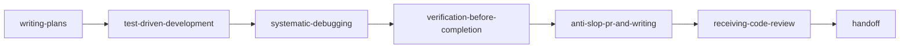

<!-- SPDX-FileCopyrightText: 2026 Sebastien Rousseau -->
<!-- SPDX-License-Identifier: Apache-2.0 OR MIT -->

<p align="center">
  
</p>

<h1 align="center">AgtMLS</h1>

<p align="center">
  A content-addressed registry of agent skills, system prompts, commands and subagents, verified at install for Claude Code, OpenAI Codex, Aider, Google Antigravity and compatible runtimes.
</p>

<p align="center">
  <a href="https://github.com/sebastienrousseau/agtmls/actions"></a>
  <a href="https://pypi.org/project/agtmls/"></a>
  <a href="https://github.com/sebastienrousseau/agtmls/tree/main/docs"></a>
  <a href="https://scorecard.dev/viewer/?uri=github.com/sebastienrousseau/agtmls"></a>
  <a href="LICENSE-APACHE"></a>
  <a href="https://github.com/sebastienrousseau/agtmls/blob/main/docs/POLICIES.md">= 3.10" /></a>
</p>

---

## Contents

**Getting started**

- [Install](#install) — Python package, `uvx` / `pipx`, agent plugins, workspace symlinks, source
- [Requirements](#requirements) — toolchain floor, platforms
- [Quick Start](#quick-start) — list, inspect, audit and verify in one session

**The AgtMLS ecosystem**

- [The AgtMLS ecosystem](#the-agtmls-ecosystem) — `agtmls-spec`, `agtmls-core`, `agtmls-wasm`, `agtmls-action`, `agtmls-mcp`, `agtmls-lsp`

**Library reference**

- [Capabilities at a glance](#capabilities-at-a-glance) — the current surface by theme
- [Ecosystem comparison](#ecosystem-comparison) — why no matrix is published yet
- [Benchmarks](#benchmarks) — headline numbers; full tables in [`BENCHMARKS.md`](BENCHMARKS.md)
- [Features](#features) — discipline pipeline, editorial doctrine, skill contract, CLI
- [Configuration](#configuration) — bundles, providers, profiles, environment
- [Examples](#examples) — runnable example index

**Operational**

- [When not to use AgtMLS](#when-not-to-use-agtmls) — limitations
- [Development](#development) — make targets, the check gate, CI
- [Security](#security) — boundaries, the analyzer, install verification, release evidence
- [Documentation](#documentation) — all reference docs
- [Stability guarantees](#stability-guarantees) — SemVer axis, output stability, minimum toolchain discipline
- [License](#license)

---

## Install

### As a Python library

```toml
[project]
dependencies = ["agtmls"]
```

The wheel has no dependencies: every script, validator, generator and CLI command uses the Python standard library only.

### As a CLI tool

```bash
# One-shot execution (ephemeral cache)
uvx agtmls install rust claude --skills-only --bundle noyalib

# Persistent installation
pipx install agtmls
agtmls install rust claude

# Or into the current environment
pip install agtmls
```

### As an agent plugin

| Runtime | Installation command / action | Manifest location |
| :--- | :--- | :--- |
| **Claude Code** | `/plugin marketplace add sebastienrousseau/agtmls`<br/>`/plugin install agtmls@agtmls` | `.claude-plugin/plugin.json` |
| **Google Antigravity** | `agy plugin install https://github.com/sebastienrousseau/agtmls` | `plugin.json` |
| **OpenAI Codex** | `/plugins` → Search `agtmls` → **Install Plugin** | `.agents/plugins/marketplace.json`<br/>`.codex-plugin/plugin.json` |
| **Gemini CLI** | `gemini extensions install https://github.com/sebastienrousseau/agtmls` | `gemini-extension.json`<br/>`GEMINI.md` |
| **Cursor** | `/add-plugin agtmls` | `.cursor-plugin/plugin.json` |
| **Kimi Code** | `/plugins install https://github.com/sebastienrousseau/agtmls` | `.kimi-plugin/plugin.json` |
| **OpenCode** | Follow instructions in `.opencode/INSTALL.md` | `.opencode/INSTALL.md` |

Every plugin manifest is derived from `.claude-plugin/plugin.json` and the skill tree by `python3 scripts/generate-plugin-manifests.py`.

### As a workspace symlink (hub-and-spoke)

Skills and prompts are symlinked from a local clone, so edits take effect immediately:

```bash
git clone https://github.com/sebastienrousseau/agtmls.git ~/dev/agtmls
cd ~/dev/my-service
~/dev/agtmls/scripts/setup-workspace.sh rust claude
```

`setup-workspace.sh` writes the native prompt convention (`CLAUDE.md`, `AGENTS.md` or `CONVENTIONS.md`) and links active skills into `.claude/skills/`, `.codex/skills/`, `.aider/skills/` or `.agents/skills/`. Every link and generated file is added to `.git/info/exclude`, so the working tree stays clean.

### From source (Unix Makefile)

The Makefile honours `PREFIX` (default `/usr/local`) and `DESTDIR`:

```bash
git clone https://github.com/sebastienrousseau/agtmls.git
cd agtmls
make test
make doctor

# CLI, manpage and shell completions
sudo make install

# Or into a staging directory
make DESTDIR=/tmp/stage install
```

---

## Requirements

- **Python 3.10 or newer.** CI runs Python 3.10 to 3.14 on Ubuntu and macOS for every push to `main`, and the floor and ceiling (3.10, 3.14) on pull requests. The floor policy is in [`docs/POLICIES.md`](docs/POLICIES.md).
- **No runtime dependencies.** Standard library only.
- **Platforms.** Linux and macOS, both in CI; other POSIX systems are expected to work but are not tested.
- **Git**, for the workspace and source installs. Maintainer commits and tags are signed with the OpenSSH keys in [`KEYS.asc`](KEYS.asc).

---

## Quick Start

```bash
agtmls list                              # the 31 registered skills
agtmls list commands                     # slash commands
agtmls search debugging                  # search by topic or tag
agtmls show anti-slop-pr-and-writing     # metadata, risk level and instructions
agtmls audit --all --strict              # static security analysis of every skill
agtmls install rust claude               # verify the registry, install, write a lockfile
agtmls verify claude                     # re-check the installed tree against it
agtmls doctor                            # local health checks
```

`install` refuses with exit `3` if the registry does not match its own `index.json`, and `verify` reports any installed skill that changed since. [Security](#security) explains what each check does and does not prove.

---

## The AgtMLS ecosystem

Agent skills are instructions a model will follow. Copied between repositories by hand, no two checkouts agree, nobody can say whether an installed skill is the one that was published, and a hidden instruction stays invisible until a model acts on it. AgtMLS is the registry, and the repositories below implement the same specification for other surfaces. [`docs/ECOSYSTEM.md`](docs/ECOSYSTEM.md) records each one's state.

| Component | Purpose | Use case |
| :--- | :--- | :--- |
| [`agtmls`](https://github.com/sebastienrousseau/agtmls) | The registry, CLI and reference implementation (Python) | Install, verify and audit skills |
| [`agtmls-spec`](https://github.com/sebastienrousseau/agtmls-spec) | Normative documents, rules as data, schemas, conformance corpus | Implement a conforming tool |
| [`agtmls-core`](https://github.com/sebastienrousseau/agtmls-core) | Rust engine: digest, rules, analyzers, lockfile | Embed verification in a Rust tool |
| [`agtmls-wasm`](https://github.com/sebastienrousseau/agtmls-wasm) | `@agtmls/wasm`, the engine compiled to WebAssembly | Run the analyzer in Node or a browser |
| [`agtmls-action`](https://github.com/sebastienrousseau/agtmls-action) | GitHub Action emitting SARIF to code scanning | Audit skills in pull requests |
| [`agtmls-mcp`](https://github.com/sebastienrousseau/agtmls-mcp) | Model Context Protocol server over stdio | Give an agent registry tools and resources |
| [`agtmls-lsp`](https://github.com/sebastienrousseau/agtmls-lsp) | Language server: diagnostics, frontmatter completion, code actions | Author skills in an editor |

---

## Capabilities at a glance

| Area | Capability | Status |
| :--- | :--- | :--- |
| Registry | 31 skills conforming to the [Agent Skills specification](https://agentskills.io), in [`skills/`](skills/) | Shipped |
| Registry | 10 system prompts: `_base.md` plus Rust, Python, Go, C++, Swift, TypeScript, JavaScript, Ruby, Bash, in [`system-prompts/`](system-prompts/) | Shipped |
| Registry | 4 slash commands (`agtmls`, `agtmls-audit`, `agtmls-new-skill`, `agtmls-release`), in [`commands/`](commands/) | Shipped |
| Registry | 4 subagents (`anti-slop-editor`, `security-sentinel`, `skill-author`, `registry-auditor`), in [`agents/`](agents/) | Shipped |
| Integrity | Per-skill SHA-256 `integrity` digest, verified before install and recorded in a lockfile | Shipped |
| Integrity | `agtmls verify`: modified, missing and unmanaged skills, exit `3` on drift | Shipped |
| Analysis | Static analyzer with stable rule IDs (`AGT-STEG-*`, `AGT-INJ-*`, `AGT-EXEC-*`, `AGT-EXFIL-*`, `AGT-CAP-*`, `AGT-POLICY-*`), gated against an adversarial corpus | Shipped; heuristic, see [Security](#security) |
| Providers | 4 native agents, 6 plugin targets, 13 export targets, in [`providers.json`](providers.json) | Shipped |
| Profiles | 6 named profiles (`minimal`, `polyglot`, `noyalib`, `security`, `research`, `discipline`), in [`profiles.json`](profiles.json) | Shipped |
| Supply chain | SPDX 2.3 and CycloneDX 1.6 SBOMs, an in-toto statement, signed tags, one-build releases audited after publishing | Shipped |

---

## Ecosystem comparison

No comparison matrix is published yet. A matrix is only worth reading if every cell is sourced and dated for each project it names, and that evidence has not been gathered. [`docs/ECOSYSTEM.md`](docs/ECOSYSTEM.md) documents the AgtMLS repositories themselves.

---

## Benchmarks

Cold-start latency of the commands a reader runs first, and of the two operations over the whole registry, measured in fresh processes. Every number below is rendered from [`benchmarks/results/`](benchmarks/results/) by `generate-benchmarks-doc.py`, and the gate fails if the table and the results diverge.

<!-- generated:headline sources="benchmarks/results/latency.json:242aed18de0eedae2c2cdf5ba07788a02a17a820ca6fdb09e1b812ad84be1050" -->
| Scenario | Result | Environment |
| :--- | ---: | :--- |
| `agtmls list`, cold start | 38 ms P50 | macOS 26.7, arm64, Python 3.12.14 |
| `agtmls search`, cold start | 37 ms P50 | macOS 26.7, arm64, Python 3.12.14 |
| Digest every skill | 48 ms P50 | macOS 26.7, arm64, Python 3.12.14 |
| `agtmls audit --all --strict` | 264 ms P50 | macOS 26.7, arm64, Python 3.12.14 |
<!-- /generated:headline -->

See [`BENCHMARKS.md`](BENCHMARKS.md) for the methodology, every workload, the regression thresholds and the scaling measurement.

---

## Features

### The discipline skills pipeline

Six general skills (`bundle: null`) govern day-to-day engineering in any language, in order:



| Phase | Skill | Invariant enforced |
| :--- | :--- | :--- |
| **Decompose** | [`writing-plans`](skills/writing-plans/) | A step is done only when something observable changes. Decompose multi-step tasks before modifying code. |
| **Build** | [`test-driven-development`](skills/test-driven-development/) | A test you have not seen fail proves nothing. Write minimal failing tests before implementation. |
| **Diagnose** | [`systematic-debugging`](skills/systematic-debugging/) | No edit before an explanation. Formulate hypotheses and identify root causes with minimal reproductions. |
| **Verify** | [`verification-before-completion`](skills/verification-before-completion/) | A claim you have not observed is a guess. Fresh test logs and commands are required before marking complete. |
| **Polish** | [`anti-slop-pr-and-writing`](skills/anti-slop-pr-and-writing/) | Engineers read diffs to understand intent and mechanics. Eliminate conversational filler and robotic clichés. |
| **Review** | [`receiving-code-review`](skills/receiving-code-review/) | Every review comment gets an explicit technical decision, code adjustment, or empirical reply. |
| **Handoff** | [`handoff`](skills/handoff/) | Document exact branch state, test commands, and open questions so readers act without asking questions. |

### Editorial doctrine

The [`anti-slop-pr-and-writing`](skills/anti-slop-pr-and-writing/) skill and the [`anti-slop-editor`](agents/anti-slop-editor.md) subagent keep pull requests, commits, comments and documentation dense and in a human voice. They strip five patterns:

1. **Sycophancy and robotic apologies** (`"Certainly!"`, `"Sorry for the oversight."`), in favour of direct statements of action and findings.
2. **Throat-clearing openers** (`"Here's the thing..."`, `"Let's dive in..."`), in favour of the problem stated in sentence one.
3. **Binary contrasts and fake profundity** (`"It's not X. It's Y."`), in favour of concrete trade-offs and measurements.
4. **Fluffy summaries and emoji theatre**, in favour of the root cause, the change, and the test proof.
5. **Comments that paraphrase syntax** (`// increment counter`), in favour of comments explaining invariants and constraints.

The full before-and-after catalogue is in [`skills/anti-slop-pr-and-writing/reference.md`](skills/anti-slop-pr-and-writing/reference.md).

### The skill contract

Every skill follows the [Agent Skills specification](https://agentskills.io/specification.md) and passes [`scripts/validate-skills.py`](scripts/validate-skills.py):

```yaml
---
name: anti-slop-pr-and-writing
description: "Eliminate AI slop, clichés, sycophancy, and robotic filler from PR descriptions, commit messages, code comments, and technical documentation. Load when reviewing or authoring PRs, drafting release notes, or stripping conversational apologies and binary contrasts while preserving human voice and technical facts."
license: Apache-2.0 OR MIT
compatibility: "Tested with Claude Code, Codex, Antigravity, and Aider skill layouts"
allowed-tools: "Read Glob Grep Write Edit"
metadata:
  agtmls-owner: "Sebastien Rousseau"
  agtmls-maturity: "hardened"
  agtmls-risk-level: "low"
  agtmls-network-access: "none"
  agtmls-writes-files: "true"
  agtmls-executes-commands: "false"
  agtmls-handles-secrets: "false"
  agtmls-requires-human-review: "true"
---
```

1. **Closed key set**: only `name`, `description`, `license`, `compatibility`, `allowed-tools` and `metadata`.
2. **Name**: kebab-case, at most 64 characters, equal to the directory name.
3. **Trigger cue**: a description of at most 1024 characters that says when to load the skill (`"load when"`, `"use for"`, `"trigger"`).
4. **Progressive disclosure**: `SKILL.md` is capped at 500 lines; catalogues and references live in `reference.md`, loaded on demand.
5. **Evaluations**: positive and negative trigger cases in [`evals/cases/`](evals/cases/) and behavioural assertions in [`evals/behavioral/cases/`](evals/behavioral/cases/).

### Command line

`agtmls` (or `python3 scripts/agtmls.py` in a clone) dispatches every registry operation:

```bash
agtmls doctor                     # local health
agtmls status
agtmls check                      # every check in checks.json
agtmls audit --all --strict       # static security analysis
agtmls list                       # registry discovery
agtmls search yaml
agtmls show anti-slop-pr-and-writing
agtmls stats
agtmls bench                      # evaluations and benchmarks
agtmls scaffold-skill candidate-skill
agtmls import-skill /path/to/external/skill --name candidate-skill
agtmls index --write              # derived artifacts
agtmls plugin-manifests --write
agtmls mcp-resources --write
agtmls sbom --write
agtmls provenance --write
agtmls docs-site --write
```

Shell completions (Bash, Zsh, Fish) and the `agtmls(1)` manpage are generated from the CLI definition (`make completions`, `make man`) and installed by `make install`. The full reference is [`docs/cli.md`](docs/cli.md).

---

## Configuration

### General skills and project bundles

The skill tree is flat, `skills/<name>/SKILL.md`, because agent runtimes scan their skills directories non-recursively and silently ignore nested skills. Scope comes from `metadata.json` instead:

- **General skills** (`"bundle": null`), such as `writing-plans` and `systematic-debugging`, are linked into every consumer repository.
- **Project bundles** (`"bundle": "noyalib"`) are linked only when requested with `--bundle <name>`.

```bash
agtmls install python claude --skills-only                    # general skills only
agtmls install rust claude --skills-only --bundle noyalib     # plus the noyalib bundle
```

### Providers and profiles

[`providers.json`](providers.json) defines three delivery modes:

| Mode | Targets | Mechanism |
| :--- | :--- | :--- |
| **Native agents** | Aider, Antigravity, Claude Code, Codex | Direct installation into the runtime's skills directory |
| **Plugin targets** | Antigravity, Codex, Cursor, Gemini CLI, Kimi Code, OpenCode | The runtime's own plugin manifest |
| **Export targets** | Anthropic, Continue, Cursor, DeepSeek, generic, GitHub Copilot, Google Gemini, Mistral, Ollama, OpenAI, Qwen, Windsurf, Zed | Provider-adapted Markdown bundles |

[`profiles.json`](profiles.json) names curated subsets for export:

```bash
agtmls export --provider openai --profile polyglot --out-dir dist
agtmls export --provider anthropic --profile noyalib --out-dir dist
```

### Environment

| Variable | Effect |
| :--- | :--- |
| `AGTMLS_HOME` | Run the installed `agtmls` against this checkout instead of the registry bundled in the wheel |
| `SOURCE_DATE_EPOCH` | Pin the timestamp the SBOM and provenance generators give changed content, for reproducible builds |

---

## Examples

There is no `examples/` directory; the runnable examples are:

- [Quick Start](#quick-start) — the everyday commands, in order.
- [`docs/cli.md`](docs/cli.md) — the command-line reference.
- [`templates/`](templates/) — what `agtmls scaffold-skill` renders a new skill from.
- [`evals/cases/`](evals/cases/) and [`evals/behavioral/cases/`](evals/behavioral/cases/) — trigger and behavioural cases for every skill.
- [`evals/security/corpus.json`](evals/security/corpus.json) — malicious and benign skills the analyzer is gated against.

---

## When not to use AgtMLS

AgtMLS is a deterministic, versioned registry of engineering skills. Do not use it:

- **As malware detection for third-party skills.** `agtmls audit` is a static, pattern-based first pass. It does not execute or detonate a skill, and packed or obfuscated payloads can evade it. Pair it with a sandboxed runtime and a human review for anything you did not write.
- **As a runtime sandbox.** AgtMLS ships declarative skills, prompts and tool configuration; it does not isolate what an agent does with them.
- **For uncurated prompt collections.** Every skill must pass semantic collision checks (similarity below 0.75), behavioural eval assertions and frontmatter validation.
- **Without reproducible release versioning.** Releases follow the strict patch line in [`VERSIONING.md`](VERSIONING.md).

---

## Development

```bash
make check      # every check in checks.json
make test       # unit tests
make bench      # routing and behavioural evaluations, benchmarks
make doctor     # registry diagnostics
make clean      # caches and bytecode
```

Local development needs Python 3.10+ and `make`. [`DEVELOPMENT.md`](DEVELOPMENT.md) reproduces every CI gate locally; [`docs/checks.md`](docs/checks.md) lists the checks, generated from `checks.json`. CI adds unit coverage (98% floor, library core 100%), ruff, CodeQL, SBOM schema validation, an API-breakage check and a wheel-size ceiling.

```text
agtmls/
├── .claude-plugin/        # Claude Code plugin and marketplace manifests
├── .github/               # Workflows, Dependabot, issue and PR templates
├── agents/                # Subagents
├── commands/              # Slash commands
├── completions/           # Generated shell completions
├── docs/                  # Architecture, CLI, checks, ecosystem, policies
├── evals/                 # Trigger, behavioural and security suites
├── references/            # Registry schema and bundle specifications
├── scripts/               # CLI, generators and validators (stdlib only)
├── share/man/man1/        # Generated manpage
├── skills/                # One flat directory per skill
├── system-prompts/        # _base.md and language profiles
├── src/                   # The installable package
├── CATALOG.md             # Human-readable catalogue (generated)
├── checks.json            # The check gate: the one list CI and `agtmls check` run
├── index.json             # Machine-readable registry index (generated)
├── mcp-resources.json     # MCP resource catalogue (generated)
├── profiles.json          # Named profiles
├── providers.json         # Native agents, plugin and export targets
├── SBOM.spdx.json         # SPDX 2.3 SBOM (generated; CycloneDX alongside)
├── provenance.json        # Unsigned in-toto statement of registry state (generated)
└── site/index.html        # Static catalogue (generated)
```

---

## Security

Two kinds of protection, and they are not equally strong. **Content addressing and install verification** are structural: a skill that differs from what the registry published is refused, whatever it contains. **The static analyzer** is first-stage triage: it flags known patterns of prompt injection, hidden Unicode, unsafe execution and capability escalation, and a determined author can evade it — packed or obfuscated payloads bypass static skill scanners over 90% of the time ([arXiv 2607.02357](https://arxiv.org/abs/2607.02357)). [`SECURITY.md`](SECURITY.md#boundaries-and-heuristics) lists which is which.

### Content addressing and install verification

Every skill in [`index.json`](index.json) carries an `integrity` digest, a SHA-256 over a manifest of its files, defined normatively in [`agtmls-spec`](https://github.com/sebastienrousseau/agtmls-spec) and stable across a git clone, a `--copy` install, an extracted wheel and a release tarball. `install` verifies the **source** registry before copying anything and refuses with exit `3` on a mismatch, then writes `.agtmls/manifest.json` recording what each skill hashed to. `verify` recomputes those digests:

| Status | Meaning | Exit |
| :--- | :--- | ---: |
| *(clean)* | Every recorded skill is byte-identical to what was installed | `0` |
| `MODIFIED` | Content changed since install — a local edit, or tampering | `3` |
| `MISSING` | Recorded in the lockfile but no longer present | `3` |
| `UNMANAGED` | Present but not installed by AgtMLS. Reported, never deleted | `0` |

Verification reports rather than repairs: silently rewriting a skill whose digest moved would destroy a local edit and hide tampering behind the same behaviour.

### The static analyzer

[`scripts/audit-skill.py`](scripts/audit-skill.py) inspects every file in a skill — markdown, shell, Python, JSON and anything executable — without running it. Each finding has a stable rule ID, so it can be suppressed, exported or tracked:

- **Invisible Unicode** (`AGT-STEG-*`): zero-width characters, bidirectional overrides, variation selectors, soft hyphens, invisible operators, Hangul fillers and tag characters used to hide instructions from a reviewer.
- **Prompt injection** (`AGT-INJ-*`): instruction overrides, developer-mode exploits, guardrail bypasses.
- **Dangerous shell** (`AGT-EXEC-*`): pipe-to-shell, root wipes, credential access, reverse shells.
- **Exfiltration** (`AGT-EXFIL-*`): markdown image pingbacks that leak session context.
- **Capability escalation** (`AGT-CAP-*`): frontmatter granting `Bash`, `Write` or `WebFetch` while `metadata.json` denies them. Runtimes that pre-approve `allowed-tools`, such as Claude Code, grant what the frontmatter says; runtimes that treat it as informational, such as Apache Maka, do not.
- **Policy honesty** (`AGT-POLICY-*`): skills declaring `executes_commands: false` or `network_access: none` that tell the model to run commands or fetch URLs. A missing or unparseable `metadata.json` is itself a finding.

The analyzer is gated against an adversarial corpus ([`evals/security/corpus.json`](evals/security/corpus.json), run by [`scripts/run-security-evals.py`](scripts/run-security-evals.py)): payloads split across lines, alternate invisible channels, malicious non-markdown files, and skills that omit their policy, with benign fixtures gating false positives. `agtmls import-skill` audits before copying, refuses on any CRITICAL or HIGH finding, and records the import as unattested (`maturity: draft`, `risk_level: high`, `requires_human_review: true`).

### Release evidence

- **SBOMs**: [`SBOM.spdx.json`](SBOM.spdx.json) (SPDX 2.3) and `SBOM.cyclonedx.json` (CycloneDX 1.6) hash every shipped file; CI validates both against their schemas.
- **Provenance**: [`provenance.json`](provenance.json) is an unsigned in-toto statement of registry state, pinned to the SBOM's digest. The signed provenance of a release is the build attestation `release.yml` emits through Sigstore, and PyPI carries PEP 740 attestations for the uploaded files.
- **Signed tags and commits**: maintainer keys are in [`KEYS.asc`](KEYS.asc). A release is built once, checksummed, and read back from the tag, the GitHub release and PyPI before it counts as published ([`RELEASE.md`](RELEASE.md)).
- **Scanning**: CodeQL analyses the Python and the workflows; Dependabot watches the pinned actions and Python tooling.

Report vulnerabilities according to [`SECURITY.md`](SECURITY.md).

---

## Documentation

| Document | Purpose |
| :--- | :--- |
| [`CATALOG.md`](CATALOG.md) | Every skill, subagent and command in the registry. |
| [`docs/ARCHITECTURE.md`](docs/ARCHITECTURE.md) | Layout, generator pipelines and adapter compilation. |
| [`docs/cli.md`](docs/cli.md) | The command-line reference, with examples. |
| [`docs/checks.md`](docs/checks.md) | Every check the gate runs, generated from `checks.json`. |
| [`docs/ECOSYSTEM.md`](docs/ECOSYSTEM.md) | The AgtMLS repositories and their state. |
| [`docs/POLICIES.md`](docs/POLICIES.md) | Toolchain floor and support policy. |
| [`DEVELOPMENT.md`](DEVELOPMENT.md) | Developer workflow and local reproduction of CI. |
| [`RELEASE.md`](RELEASE.md) | How a release is built, published and audited. |
| [`AGENTS.md`](AGENTS.md) | Invariants for AI-assisted contributors. |
| [`SECURITY.md`](SECURITY.md) | Disclosure policy, boundaries and heuristics. |
| [`CONTRIBUTING.md`](CONTRIBUTING.md) | Pull request guidelines, conventional commits and signing. |
| [`BENCHMARKS.md`](BENCHMARKS.md) | Measured timings, the regression method and its limits. |
| [`CHANGELOG.md`](CHANGELOG.md) | Per-release record of additions, fixes and changes. |

---

## Stability guarantees

- **SemVer axis**: public releases stay on the `0.0.x` line and move by exactly `0.0.1` (`v0.0.1` → `v0.0.999` → `v0.1.0`), per [`VERSIONING.md`](VERSIONING.md). Until `1.0`, any release may change the CLI or the registry format; [`CHANGELOG.md`](CHANGELOG.md) marks breaking changes under **Breaking**, and CI checks the public Python API against the last release.
- **Output stability**: every generated artifact is deterministic and checked in CI with `--check`; the wheel and sdist are byte-reproducible from the same commit.
- **Minimum toolchain**: Python 3.10 is the floor. It is raised only when 3.10 reaches upstream end of life ([`docs/POLICIES.md`](docs/POLICIES.md)).

---

## License

Dual-licensed under the **Apache License, Version 2.0** and the **MIT License**, at your option:

- [Apache License, Version 2.0](LICENSE-APACHE)
- [MIT License](LICENSE-MIT)

<p align="right"><a href="#contents">Back to Top</a></p>
